# BÁO CÁO TỔNG QUÁT PBL5

## Trang bìa gợi Ă½

TRƯỜNG ĐẠI HỌC BÁCH KHOA
KHOA CÔNG NGHỆ THÔNG TIN

**BÁO CÁO**
**PBL5 - Dá»° ÁN KỸ THUẬT MÁY TÍNH**

**HỆ THỐNG QUẢN LÝ BĂƒI XE THĂ”NG MINH TÍCH HỢP RFID, NHẬN DIỆN BIỂN SỐ VĂ€ CẢNH BÁO QUÁ TẢI**

Giảng viĂªn hÆ°á»›ng dẫn: Cao Văn C

| NhĂ³m sinh viĂªn thá»±c hiện | Lá»›p học phần |
| --- | --- |
| [Họ tĂªn SV 1] | [Lá»›p] |
| [Họ tĂªn SV 2] | [Lá»›p] |
| [Họ tĂªn SV 3] | [Lá»›p] |
| [Họ tĂªn SV 4] | [Lá»›p] |

Đà Nẵng, 06/2025

---

## TĂ³m tắt đồ Ă¡n

Đồ Ă¡n xĂ¢y dá»±ng hệ thống quản lĂ½ bĂ£i xe thĂ´ng minh nhằm giảm thao tĂ¡c thủ cĂ´ng khi xe ra vĂ o, hạn chế sai sĂ³t trong ghi nhận lượt gá»­i xe vĂ  há»— trợ giĂ¡m sĂ¡t tình trạng quĂ¡ tải của bĂ£i Ä‘á»—. Hệ thống sá»­ dụng ESP32 kết hợp đầu đọc RFID MFRC522 để nhận diện thẻ, cảm biến siĂªu Ă¢m để há»— trợ phĂ¡t hiện vật cản, servo để Ä‘iều khiển barrier, LCD vĂ  buzzer để phản hồi trạng thĂ¡i tại cổng. Dữ liệu quẹt thẻ được gá»­i qua Wi-Fi đến backend FastAPI, lÆ°u trữ trong MongoDB vĂ  hiển thị trĂªn dashboard web. Phần mềm quản lĂ½ cĂ¡c đối tượng khĂ¡ch hĂ ng, phÆ°Æ¡ng tiện, thẻ RFID, phiĂªn gá»­i xe, sÆ¡ đồ chá»— Ä‘á»—, gĂ³i cÆ°á»›c vĂ  doanh thu. Khi xe vĂ o, hệ thống kiểm tra thẻ, tạo phiĂªn gá»­i xe vĂ  gĂ¡n chá»— trống; khi xe ra, hệ thống Ä‘Ă³ng phiĂªn, tĂ­nh thời gian gá»­i vĂ  phĂ­ Ä‘á»— xe. Hệ thống cÅ©ng thống kĂª số chá»— cĂ²n trống, tá»· lệ lấp đầy vĂ  từ chối xe vĂ o khi bĂ£i khĂ´ng cĂ²n chá»—. Module ESP32-CAM/AI nhận diện biển số được đề xuất tĂ­ch hợp để chụp ảnh, phĂ¡t hiện vĂ¹ng biển số vĂ  nhận dạng kĂ½ tá»± nhằm đối chiếu vá»›i thĂ´ng tin phÆ°Æ¡ng tiện.

LÆ°u Ă½ trung thá»±c khi viết bĂ¡o cĂ¡o: trong mĂ£ nguồn hiện tại Ä‘Ă£ cĂ³ RFID, ESP32 firmware, backend FastAPI/MongoDB vĂ  dashboard web; chÆ°a thấy module ESP32-CAM hoặc code nhận diện biển số. Nếu chÆ°a triển khai kịp, nĂªn trình bĂ y phần nhận diện biển số lĂ  "thiết kế đề xuất", "thá»­ nghiệm riĂªng" hoặc "hÆ°á»›ng phĂ¡t triển", khĂ´ng ghi lĂ  chức năng hoĂ n thiện.

---

## Bảng phĂ¢n cĂ´ng nhiệm vụ

| Sinh viĂªn thá»±c hiện | CĂ¡c nhiệm vụ | Tá»± Ä‘Ă¡nh giĂ¡ |
| --- | --- | --- |
| [SV 1] | Thiết kế mạch ESP32; kết nối RFID MFRC522, LCD I2C, servo, buzzer, cảm biến siĂªu Ă¢m; cấu hình firmware MicroPython; kiểm thá»­ quẹt thẻ vĂ  Ä‘iều khiển barrier. | ÄĂ£ hoĂ n thĂ nh |
| [SV 2] | XĂ¢y dá»±ng backend FastAPI; thiết kế API quẹt thẻ, khĂ¡ch hĂ ng, xe, phiĂªn gá»­i xe, chá»— Ä‘á»—, gĂ³i cÆ°á»›c, doanh thu; kết nối MongoDB. | ÄĂ£ hoĂ n thĂ nh |
| [SV 3] | XĂ¢y dá»±ng giao diện dashboard web; quản lĂ½ khĂ¡ch hĂ ng, xe, đăng kĂ½ thẻ, lịch sá»­, map chá»— Ä‘á»—, biểu đồ doanh thu vĂ  tá»· lệ lấp đầy. | ÄĂ£ hoĂ n thĂ nh |
| [SV 4] | Thiết kế/khảo sĂ¡t module ESP32-CAM vĂ  AI nhận diện biển số; xĂ¢y dá»±ng kịch bản kiểm thá»­, bĂ¡o cĂ¡o kết quả, tổng hợp tĂ i liệu. | ChÆ°a hoĂ n thĂ nh hoặc KhĂ´ng triển khai nếu chÆ°a tĂ­ch hợp |

---

## Mục lục gợi Ă½

1. Giới thiệu
1.1. Bối cảnh vĂ  hiện trạng
1.2. Vấn đề cần giải quyết
1.3. Mục tiĂªu vĂ  phạm vi đồ Ă¡n
1.4. Giải phĂ¡p tổng quan

2. Giải phĂ¡p
2.1. Giải phĂ¡p phần cứng vĂ  truyền thĂ´ng
2.2. Giải phĂ¡p AI/KHDL
2.3. Giải phĂ¡p phần mềm

3. Kết quả
3.1. MĂ´i trường thá»±c nghiệm
3.2. Dữ liệu vĂ  kịch bản kiểm thá»­
3.3. Kết quả chức năng
3.4. ÄĂ¡nh giĂ¡ hệ thống

4. Kết luận
4.1. Kết quả đạt được
4.2. Hạn chế
4.3. HÆ°á»›ng phĂ¡t triển

5. Danh mục tĂ i liệu tham khảo

---

# 1. Giới thiệu

## 1.1. Bối cảnh vĂ  hiện trạng

Tại cĂ¡c bĂ£i xe trường học, chung cÆ°, siĂªu thị hoặc cÆ¡ quan, quĂ¡ trình ghi vĂ© thủ cĂ´ng thường mất thời gian, dá»… nhầm lẫn biển số, khĂ³ truy vết lịch sá»­ gá»­i xe vĂ  khĂ³ thống kĂª số chá»— cĂ²n lại theo thời gian thá»±c. CĂ¡c hệ thống hiện đại thường kết hợp thẻ RFID, camera nhận diện biển số, cảm biến cổng, phần mềm quản lĂ½ vĂ  cÆ¡ sở dữ liệu tập trung. Tuy nhiĂªn, cĂ¡c giải phĂ¡p thÆ°Æ¡ng mại cĂ³ chi phĂ­ cao, khĂ³ tĂ¹y biến cho mĂ´ hình nhỏ hoặc mục tiĂªu học thuật. Vì vậy, đề tĂ i tập trung xĂ¢y dá»±ng má»™t mĂ´ hình bĂ£i xe thĂ´ng minh quy mĂ´ nhỏ, cĂ³ khả năng tá»± Ä‘á»™ng hĂ³a quy trình xe vĂ o/ra vĂ  cung cấp dashboard quản trị.

## 1.2. Vấn đề cần giải quyết

Hệ thống cần giải quyết cĂ¡c vấn đề chĂ­nh: nhận diện nhanh người dĂ¹ng hoặc phÆ°Æ¡ng tiện bằng thẻ RFID; tá»± Ä‘á»™ng ghi nhận thời gian xe vĂ o/ra; tĂ­nh phĂ­ theo thời gian hoặc theo gĂ³i cÆ°á»›c; quản lĂ½ khĂ¡ch hĂ ng, xe vĂ  thẻ; giĂ¡m sĂ¡t số lượng chá»— trống; cảnh bĂ¡o hoặc từ chối khi bĂ£i đầy; lÆ°u lịch sá»­ giao dịch để tra cứu. Vá»›i phần mở rá»™ng AI, hệ thống cần chụp ảnh biển số, nhận diện kĂ½ tá»± vĂ  đối chiếu vá»›i biển số Ä‘Ă£ đăng kĂ½ để tăng Ä‘á»™ an toĂ n.

## 1.3. Mục tiĂªu vĂ  phạm vi

Mục tiĂªu của đồ Ă¡n lĂ  xĂ¢y dá»±ng hệ thống IoT hoĂ n chỉnh gồm thiết bị cổng dĂ¹ng ESP32, backend API, cÆ¡ sở dữ liệu vĂ  giao diện web quản trị. Phạm vi triển khai hiện tại gồm quẹt thẻ RFID, check-in/check-out tá»± Ä‘á»™ng, Ä‘iều khiển barrier, quản lĂ½ chá»— Ä‘á»—, tĂ­nh phĂ­, thống kĂª doanh thu vĂ  hiển thị dashboard. Phần ESP32-CAM/nhận diện biển số được Ä‘Æ°a vĂ o nhÆ° module mở rá»™ng: nếu nhĂ³m Ä‘Ă£ thá»­ nghiệm riĂªng, trình bĂ y kết quả thá»­ nghiệm; nếu chÆ°a, trình bĂ y thiết kế vĂ  hÆ°á»›ng tĂ­ch hợp.

## 1.4. Giải phĂ¡p tổng quan

Hệ thống được chia thĂ nh ba lá»›p. Lá»›p thiết bị tại cổng gồm ESP32, đầu đọc RFID, servo, LCD, buzzer vĂ  cảm biến siĂªu Ă¢m. Lá»›p dịch vụ gồm backend FastAPI nhận dữ liệu quẹt thẻ, xá»­ lĂ½ nghiệp vụ vĂ  lÆ°u MongoDB. Lá»›p giao diện gồm dashboard web hiển thị thống kĂª, chá»— Ä‘á»—, khĂ¡ch hĂ ng, xe, gĂ³i cÆ°á»›c, lịch sá»­ vĂ  doanh thu.

```mermaid
flowchart LR
    RFID[RFID MFRC522] --> ESP32[ESP32 MicroPython]
    Ultrasonic[HC-SR04] --> ESP32
    ESP32 --> Servo[Servo barrier]
    ESP32 --> LCD[LCD I2C + buzzer]
    ESP32 -- HTTP/Wi-Fi --> API[FastAPI backend]
    Cam[ESP32-CAM - thiết kế bổ sung] -- ảnh biển số --> AI[AI/OCR nhận diện biển số]
    AI --> API
    API --> DB[(MongoDB)]
    Web[Web Dashboard] -- REST API --> API
```

# 2. Giải phĂ¡p

## 2.1. Giải phĂ¡p phần cứng vĂ  truyền thĂ´ng

### ThĂ nh phần phần cứng

| Linh kiện | Vai trĂ² | Giao tiếp/tham số chĂ­nh | Ghi chĂº |
| --- | --- | --- | --- |
| ESP32 DevKit | Vi Ä‘iều khiển trung tĂ¢m tại cổng | Wi-Fi, SPI, I2C, PWM, GPIO | Chạy MicroPython, gá»­i HTTP request đến backend |
| MFRC522 | Đọc thẻ RFID | SPI, 13.56 MHz | Đọc UID thẻ để xĂ¡c định khĂ¡ch/xe |
| Thẻ RFID | Định danh người gá»­i xe | UID duy nhất | LiĂªn kết vá»›i khĂ¡ch hĂ ng vĂ  xe trong database |
| Servo SG90/MG996R | Điều khiển barrier | PWM 50 Hz | GĂ³c Ä‘Ă³ng/mở cấu hình trong firmware |
| LCD 16x2 I2C | Hiển thị trạng thĂ¡i | I2C, địa chỉ thường 0x27 | Hiển thị READY, SCANNING, WELCOME, DENIED |
| Buzzer + LED | Phản hồi Ă¢m thanh/Ă¡nh sĂ¡ng | GPIO/PWM | BĂ¡o thĂ nh cĂ´ng hoặc lá»—i |
| HC-SR04 | PhĂ¡t hiện vật cản/gần cổng | Trigger/Echo | Há»— trợ tá»± Ä‘á»™ng Ä‘Ă³ng cổng an toĂ n |
| ESP32-CAM | Chụp ảnh biển số | Wi-Fi, camera OV2640 | ChÆ°a tĂ­ch hợp trong repo hiện tại |

### Kết nối chĂ¢n theo firmware hiện tại

| Module | ChĂ¢n ESP32 |
| --- | --- |
| RFID SCK/MOSI/MISO/CS/RST | GPIO 18/23/19/5/4 |
| Servo | GPIO 14 |
| LED | GPIO 2 |
| Buzzer | GPIO 13 |
| HC-SR04 Trigger/Echo | GPIO 26/35 |
| LCD SDA/SCL | GPIO 21/22 |

### NguyĂªn lĂ½ hoạt Ä‘á»™ng phần cứng

ESP32 khởi Ä‘á»™ng, Ä‘Ă³ng barrier, kết nối Wi-Fi vĂ  hiển thị trạng thĂ¡i sẵn sĂ ng trĂªn LCD. Khi người dĂ¹ng Ä‘Æ°a thẻ RFID vĂ o vĂ¹ng đọc, MFRC522 trả về UID thẻ. ESP32 kiểm tra thời gian chống quĂ©t lặp, Ä‘o khoảng cĂ¡ch nếu cần, sau Ä‘Ă³ gá»­i UID, mĂ£ cổng vĂ  khoảng cĂ¡ch lĂªn API `/api/v1/rfid/scan`. Backend trả về kết quả cho phĂ©p hoặc từ chối. Nếu thĂ nh cĂ´ng, ESP32 mở barrier, phĂ¡t Ă¢m bĂ¡o thĂ nh cĂ´ng vĂ  hiển thị thĂ´ng tin. Sau thời gian cấu hình, ESP32 kiểm tra cảm biến siĂªu Ă¢m rồi Ä‘Ă³ng barrier.

```mermaid
flowchart TD
    A[Bắt đầu] --> B[Kết nối Wi-Fi]
    B --> C[Hiển thị READY]
    C --> D[Quét RFID]
    D --> E{Đọc được UID?}
    E -- KhĂ´ng --> D
    E -- CĂ³ --> F[Gá»­i HTTP POST /rfid/scan]
    F --> G{Backend cho phép?}
    G -- KhĂ´ng --> H[Buzzer lá»—i, LCD DENIED]
    G -- CĂ³ --> I[Mở barrier, LCD WELCOME]
    I --> J[Đợi vĂ  kiểm tra vật cản]
    J --> K[ÄĂ³ng barrier]
    H --> C
    K --> C
```

### Truyền thông IoT

ESP32 vĂ  backend giao tiếp qua Wi-Fi bằng HTTP/REST. Dữ liệu gá»­i từ ESP32 cĂ³ dạng JSON gồm `card_uid`, `gate_id`, `distance_cm` vĂ  `timestamp`. Backend phản hồi JSON gồm `success`, `action`, `message`, `customer_name`, `vehicle_plate`, `session_id`, `parking_fee` hoặc `slot_id`. Khi mất kết nối, firmware cĂ³ cÆ¡ chế kiểm tra lại Wi-Fi vĂ  cĂ³ danh sĂ¡ch thẻ offline được phĂ©p.

### Bảng chi phĂ­ linh kiện

Điền giĂ¡ Ä‘Ăºng theo hĂ³a Ä‘Æ¡n mua thá»±c tế của nhĂ³m. Bảng dÆ°á»›i Ä‘Ă¢y lĂ  khung trình bĂ y.

| STT | Linh kiện | Số lượng | Đơn giĂ¡ thá»±c tế | ThĂ nh tiền |
| --- | --- | ---: | ---: | ---: |
| 1 | ESP32 DevKit | 1 | [điền] | [điền] |
| 2 | MFRC522 + thẻ RFID | 1 bộ | [điền] | [điền] |
| 3 | Servo SG90/MG996R | 1 | [điền] | [điền] |
| 4 | LCD 16x2 I2C | 1 | [điền] | [điền] |
| 5 | Cảm biến HC-SR04 | 1 | [điền] | [điền] |
| 6 | Buzzer, LED, Ä‘iện trở, dĂ¢y jumper | 1 bá»™ | [Ä‘iền] | [Ä‘iền] |
| 7 | Nguồn 5V/2A hoặc module nguồn | 1 | [điền] | [điền] |
| 8 | ESP32-CAM + USB TTL | 1 bộ | [điền] | [điền] |
| 9 | MĂ´ hình barrier/bĂ£i xe | 1 | [Ä‘iền] | [Ä‘iền] |
|  | **Tổng cộng** |  |  | **[điền]** |

## 2.2. Giải phĂ¡p AI/KHDL

### BĂ i toĂ¡n nhận diện biển số

Module AI nhằm tá»± Ä‘á»™ng đọc biển số từ ảnh chụp tại cổng. Quy trình đề xuất gồm: ESP32-CAM chụp ảnh khi cĂ³ xe hoặc sau khi quẹt thẻ; ảnh được gá»­i về server; server phĂ¡t hiện vĂ¹ng biển số; vĂ¹ng biển số được tiền xá»­ lĂ½; mĂ´ hình OCR nhận dạng kĂ½ tá»±; kết quả được chuẩn hĂ³a vĂ  đối chiếu vá»›i biển số lÆ°u trong bảng `vehicles`.

```mermaid
flowchart LR
    Image[Ảnh từ ESP32-CAM] --> Detect[PhĂ¡t hiện vĂ¹ng biển số]
    Detect --> Crop[Cắt vĂ  căn chỉnh biển số]
    Crop --> Preprocess[Tiền xá»­ lĂ½: grayscale, threshold, resize]
    Preprocess --> OCR[OCR kĂ½ tá»±]
    OCR --> Normalize[Chuẩn hĂ³a định dạng biển số]
    Normalize --> Compare[Đối chiếu database]
    Compare --> Result[Cho phĂ©p, cảnh bĂ¡o hoặc yĂªu cầu kiểm tra]
```

### PhÆ°Æ¡ng Ă¡n thuật toĂ¡n

PhÆ°Æ¡ng Ă¡n Ä‘Æ¡n giản lĂ  dĂ¹ng OpenCV để chuyển ảnh sang xĂ¡m, lọc nhiá»…u, phĂ¡t hiện cạnh/contour vĂ  chọn vĂ¹ng cĂ³ tá»· lệ gần giống biển số. PhÆ°Æ¡ng Ă¡n ổn định hÆ¡n lĂ  huấn luyện hoặc dĂ¹ng mĂ´ hình YOLO để phĂ¡t hiện biển số, sau Ä‘Ă³ dĂ¹ng PaddleOCR/EasyOCR/Tesseract để nhận dạng kĂ½ tá»±. Vá»›i đồ Ă¡n PBL, nĂªn trình bĂ y YOLO/OCR lĂ  hÆ°á»›ng chĂ­nh nếu cĂ³ dữ liệu gĂ¡n nhĂ£n; nếu chÆ°a cĂ³ dữ liệu đủ lá»›n, trình bĂ y OpenCV + OCR nhÆ° thá»­ nghiệm nguyĂªn mẫu.

### Dữ liệu đề xuất

Tập dữ liệu cĂ³ thể thu thập bằng ESP32-CAM hoặc Ä‘iện thoại ở cổng mĂ´ hình, gồm ảnh xe mĂ¡y/Ă´ tĂ´ trong nhiều Ä‘iều kiện Ă¡nh sĂ¡ng, gĂ³c chụp vĂ  khoảng cĂ¡ch khĂ¡c nhau. Nếu dĂ¹ng YOLO, cần gĂ¡n nhĂ£n bounding box cho lá»›p `license_plate`; nếu Ä‘Ă¡nh giĂ¡ OCR, cần nhĂ£n text biển số tÆ°Æ¡ng ứng. CĂ¡ch chia dữ liệu nĂªn lĂ  70% huấn luyện, 15% xĂ¡c nhận, 15% kiểm thá»­. Cần loại bỏ ảnh quĂ¡ mờ, quĂ¡ tối hoặc biển số bị che khuất để trĂ¡nh lĂ m sai lệch Ä‘Ă¡nh giĂ¡.

### Độ Ä‘o Ä‘Ă¡nh giĂ¡ AI

| NhĂ³m Ä‘Ă¡nh giĂ¡ | Độ Ä‘o | Ý nghÄ©a |
| --- | --- | --- |
| PhĂ¡t hiện biển số | Precision, Recall, mAP@0.5 | ÄĂ¡nh giĂ¡ mĂ´ hình tìm Ä‘Ăºng vĂ¹ng biển số |
| OCR | Character Accuracy | Tá»· lệ kĂ½ tá»± đọc Ä‘Ăºng |
| OCR | Plate Exact Match | Tá»· lệ biển số đọc Ä‘Ăºng toĂ n bá»™ |
| Hiệu năng | Inference time, FPS | Tốc Ä‘á»™ xá»­ lĂ½ ảnh |
| Hệ thống | Tá»· lệ đối chiếu Ä‘Ăºng RFID - biển số | ÄĂ¡nh giĂ¡ khả năng chống nhầm xe |

## 2.3. Giải phĂ¡p phần mềm

### Kiến trĂºc backend

Backend dĂ¹ng FastAPI, tổ chức theo cĂ¡c controller: RFID, khĂ¡ch hĂ ng, xe, phiĂªn gá»­i xe, chá»— Ä‘á»—, gĂ³i cÆ°á»›c vĂ  thống kĂª. Dữ liệu lÆ°u trong MongoDB vá»›i cĂ¡c collection chĂ­nh: `customers`, `vehicles`, `rfid_cards`, `sessions`, `parking_slots`, `packages`, `transactions`, `pending_scans`. CĂ¡c chỉ mục được tạo cho mĂ£ khĂ¡ch hĂ ng, mĂ£ xe, UID thẻ, mĂ£ phiĂªn, trạng thĂ¡i phiĂªn vĂ  thời gian vĂ o để tăng tốc truy vấn.

### Luồng xá»­ lĂ½ RFID

Khi backend nhận UID thẻ, hệ thống kiểm tra thẻ cĂ³ tồn tại khĂ´ng. Nếu thẻ Ä‘Ă£ đăng kĂ½ vĂ  Ä‘ang hoạt Ä‘á»™ng, backend tìm phiĂªn gá»­i xe Ä‘ang mở. Nếu cĂ³ phiĂªn Ä‘ang mở, hệ thống xá»­ lĂ½ check-out, cập nhật thời gian ra, tĂ­nh phĂ­, giải phĂ³ng chá»— Ä‘á»— vĂ  tạo giao dịch. Nếu khĂ´ng cĂ³ phiĂªn, hệ thống xá»­ lĂ½ check-in, tìm chá»— trống, tạo phiĂªn má»›i vĂ  Ä‘Ă¡nh dấu chá»— Ä‘Ă£ sá»­ dụng. Nếu thẻ chÆ°a tồn tại, hệ thống cĂ³ hai chế Ä‘á»™: tá»± Ä‘á»™ng đăng kĂ½ khĂ¡ch vĂ£ng lai hoặc ghi nhận thẻ chờ đăng kĂ½ trĂªn web.

```mermaid
flowchart TD
    A[Nhận card_uid] --> B{Thẻ Ä‘Ă£ tồn tại?}
    B -- KhĂ´ng --> C{Registration mode?}
    C -- CĂ³ --> D[LÆ°u pending scan]
    C -- KhĂ´ng --> E[Tạo khĂ¡ch, xe, thẻ, phiĂªn đầu tiĂªn]
    B -- CĂ³ --> F{Thẻ active?}
    F -- Không --> G[Từ chối]
    F -- CĂ³ --> H{CĂ³ session in_progress?}
    H -- CĂ³ --> I[Check-out, tĂ­nh phĂ­, giải phĂ³ng slot]
    H -- KhĂ´ng --> J{CĂ²n slot trống?}
    J -- KhĂ´ng --> K[Từ chối vì bĂ£i đầy]
    J -- CĂ³ --> L[Check-in, tạo session, gĂ¡n slot]
```

### TĂ­nh phĂ­ vĂ  gĂ³i cÆ°á»›c

PhĂ­ Ä‘á»— xe theo lượt được tĂ­nh bằng thời gian từ `entry_time` đến `exit_time`, lĂ m trĂ²n lĂªn theo giờ vĂ  nhĂ¢n vá»›i Ä‘Æ¡n giĂ¡ cấu hình `FEE_PER_HOUR = 5000` VND. Nếu khĂ¡ch hĂ ng cĂ³ gĂ³i ngĂ y hoặc gĂ³i thĂ¡ng cĂ²n hiệu lá»±c, phĂ­ gá»­i lượt được tĂ­nh bằng 0. Khi cĂ³ phĂ­ phĂ¡t sinh, backend tạo bản ghi giao dịch trong collection `transactions`.

### Quản lĂ½ quĂ¡ tải

Backend quản lĂ½ chá»— Ä‘á»— bằng collection `parking_slots`. Má»—i slot cĂ³ trạng thĂ¡i `available`, `occupied`, `reserved` hoặc `maintenance`. Khi xe vĂ o, hệ thống tìm slot `available`; nếu khĂ´ng cĂ³ slot trống, backend trả về thĂ´ng bĂ¡o bĂ£i đầy vĂ  ESP32 khĂ´ng mở barrier. Dashboard hiển thị tổng số slot, số slot trống, số slot Ä‘ang sá»­ dụng vĂ  tá»· lệ lấp đầy. CĂ³ thể bổ sung cảnh bĂ¡o sá»›m khi tá»· lệ lấp đầy vượt 80% hoặc 90%.

### Giao diện web

Frontend dĂ¹ng HTML/CSS/JavaScript, Bootstrap, Bootstrap Icons vĂ  Chart.js. CĂ¡c mĂ n hình chĂ­nh gồm Dashboard, Đăng kĂ½ thẻ, KhĂ¡ch hĂ ng, Xe, Map chá»— Ä‘á»—, GĂ³i cÆ°á»›c, Lịch sá»­ vĂ  Doanh thu. Dashboard gọi API định kỳ để hiển thị số khĂ¡ch hĂ ng, xe Ä‘ang Ä‘á»—, chá»— trống, doanh thu hĂ´m nay, biểu đồ doanh thu 7 ngĂ y vĂ  tá»· lệ lấp đầy.

# 3. Kết quả

## 3.1. MĂ´i trường thá»±c nghiệm

| ThĂ nh phần | CĂ´ng cụ/cấu hình |
| --- | --- |
| Firmware | MicroPython trĂªn ESP32 |
| Backend | Python, FastAPI, Uvicorn, Motor/PyMongo |
| Database | MongoDB, database `smart_parking` |
| Frontend | HTML, CSS, JavaScript, Bootstrap, Chart.js |
| Thiết bị cổng | ESP32, MFRC522, LCD I2C, servo, buzzer, HC-SR04 |
| Camera/AI | ESP32-CAM, OpenCV/YOLO/OCR nếu nhĂ³m triển khai thĂªm |

## 3.2. Chức năng Ä‘Ă£ triển khai

| Chức năng | Trạng thĂ¡i trong repo | MĂ´ tả kết quả |
| --- | --- | --- |
| Quẹt thẻ RFID | ÄĂ£ cĂ³ | ESP32 đọc UID vĂ  gá»­i API |
| Check-in/check-out | ÄĂ£ cĂ³ | Backend tạo/Ä‘Ă³ng phiĂªn gá»­i xe |
| Điều khiển barrier | ÄĂ£ cĂ³ firmware | Servo mở/Ä‘Ă³ng theo phản hồi backend |
| LCD/buzzer/LED | ÄĂ£ cĂ³ firmware | Phản hồi trạng thĂ¡i thĂ nh cĂ´ng/lá»—i |
| Quản lĂ½ khĂ¡ch hĂ ng, xe, thẻ | ÄĂ£ cĂ³ | CRUD vĂ  đăng kĂ½ thẻ trĂªn web |
| Quản lĂ½ chá»— Ä‘á»— | ÄĂ£ cĂ³ | GĂ¡n slot, giải phĂ³ng slot, hiển thị map |
| Cảnh bĂ¡o quĂ¡ tải | CĂ³ logic nền | Từ chối xe vĂ o khi khĂ´ng cĂ²n slot; nĂªn bổ sung cảnh bĂ¡o UI rõ hÆ¡n nếu demo |
| GĂ³i cÆ°á»›c/doanh thu | ÄĂ£ cĂ³ | GĂ³i ngĂ y/thĂ¡ng, giao dịch, thống kĂª doanh thu |
| Nhận diện biển số ESP32-CAM | ChÆ°a thấy trong repo | Đưa vĂ o phần thiết kế/hÆ°á»›ng phĂ¡t triển nếu chÆ°a tĂ­ch hợp |

## 3.3. Kịch bản kiểm thử

| Kịch bản | CĂ¡ch kiểm thá»­ | Kết quả mong đợi |
| --- | --- | --- |
| Thẻ má»›i | QuĂ©t UID chÆ°a cĂ³ trong database | Tạo khĂ¡ch/xe/thẻ/phiĂªn má»›i hoặc pending registration |
| Thẻ cÅ© vĂ o bĂ£i | QuĂ©t UID Ä‘Ă£ đăng kĂ½ vĂ  chÆ°a cĂ³ session | Tạo session, gĂ¡n slot, mở barrier |
| Thẻ cÅ© ra bĂ£i | QuĂ©t UID Ä‘ang cĂ³ session | ÄĂ³ng session, tĂ­nh phĂ­, giải phĂ³ng slot |
| Thẻ inactive/lost | Đổi status thẻ rồi quĂ©t | Backend từ chối, barrier khĂ´ng mở |
| BĂ£i đầy | Đặt toĂ n bá»™ slot thĂ nh occupied | API trả về bĂ£i đầy |
| Mất Wi-Fi/backend | Tắt backend hoặc Wi-Fi | Firmware bĂ¡o lá»—i/offline, khĂ´ng mất vĂ²ng lặp chĂ­nh |
| Dashboard | Mở web vĂ  thao tĂ¡c cĂ¡c trang | Dữ liệu cập nhật Ä‘Ăºng theo database |
| ESP32-CAM/AI | Chụp ảnh biển số vĂ  chạy nhận dạng | Trả về biển số vĂ  Ä‘á»™ tin cậy nếu Ä‘Ă£ triển khai |

## 3.4. Chỉ số Ä‘Ă¡nh giĂ¡ nĂªn Ä‘Æ°a vĂ o bĂ¡o cĂ¡o

| TiĂªu chĂ­ | CĂ¡ch Ä‘o | Mẫu ghi kết quả |
| --- | --- | --- |
| Tá»· lệ đọc RFID | Số lần đọc UID Ä‘Ăºng / tổng số lần quĂ©t | VĂ­ dụ: 48/50 = 96% |
| Độ trá»… API | Thời gian từ lĂºc ESP32 gá»­i request đến lĂºc nhận response | VĂ­ dụ: trung bình 120 ms trong LAN |
| Độ ổn định barrier | Số lần mở/Ä‘Ă³ng Ä‘Ăºng / tổng lượt | VĂ­ dụ: 30/30 lượt |
| Độ Ä‘Ăºng nghiệp vụ | Check-in/check-out Ä‘Ăºng phiĂªn | VĂ­ dụ: 20/20 lượt |
| Cảnh bĂ¡o quĂ¡ tải | Kiểm thá»­ khi hết slot | API từ chối vĂ  dashboard bĂ¡o hết chá»— |
| OCR biển số | Plate Exact Match | Điền nếu Ä‘Ă£ cĂ³ AI |
| Tốc Ä‘á»™ AI | Thời gian xá»­ lĂ½ 1 ảnh | Điền nếu Ä‘Ă£ cĂ³ AI |

# 4. Kết luận

Đồ Ă¡n Ä‘Ă£ xĂ¢y dá»±ng được mĂ´ hình bĂ£i xe thĂ´ng minh cĂ³ khả năng tá»± Ä‘á»™ng ghi nhận lượt xe vĂ o/ra bằng thẻ RFID, Ä‘iều khiển barrier bằng ESP32, lÆ°u dữ liệu tập trung vĂ  hiển thị thĂ´ng tin quản lĂ½ qua dashboard web. Backend FastAPI vĂ  MongoDB giĂºp hệ thống cĂ³ cấu trĂºc dữ liệu rõ rĂ ng, dá»… mở rá»™ng. Giao diện web há»— trợ quản lĂ½ khĂ¡ch hĂ ng, xe, thẻ RFID, phiĂªn gá»­i xe, sÆ¡ đồ chá»— Ä‘á»—, gĂ³i cÆ°á»›c vĂ  doanh thu. Hệ thống Ä‘Ă£ thể hiện được tĂ­nh IoT thĂ´ng qua kết nối giữa thiết bị phần cứng, API server vĂ  giao diện quản trị.

Hạn chế của phiĂªn bản hiện tại lĂ  module ESP32-CAM/nhận diện biển số chÆ°a được tĂ­ch hợp trong mĂ£ nguồn, cÆ¡ chế cảnh bĂ¡o quĂ¡ tải chủ yếu dừng ở việc thống kĂª vĂ  từ chối khi hết chá»—, bảo mật API cĂ²n Ä‘Æ¡n giản vĂ  chÆ°a cĂ³ xĂ¡c thá»±c người dĂ¹ng đầy đủ. Nếu cĂ³ thĂªm thời gian, nhĂ³m cĂ³ thể bổ sung camera chụp biển số, huấn luyện mĂ´ hình phĂ¡t hiện biển số, thĂªm OCR, so khá»›p biển số vá»›i thẻ RFID, thĂªm cảnh bĂ¡o qua email/Telegram, phĂ¢n quyền tĂ i khoản quản trị, thanh toĂ¡n Ä‘iện tá»­ vĂ  triển khai backend lĂªn server/cloud.

# 5. Danh mục tĂ i liệu tham khảo gợi Ă½

1. Espressif Systems, ESP32 Series Datasheet: https://documentation.espressif.com/esp32_datasheet_en.html
2. Espressif, ESP32 Camera Driver: https://components.espressif.com/components/espressif/esp32-camera
3. NXP Semiconductors, MFRC522 Standard performance MIFARE and NTAG frontend: https://www.nxp.com/products/rfid-nfc/nfc-hf/nfc-readers/standard-performance-mifare-and-ntag-frontend%3AMFRC52202HN1
4. MicroPython Documentation, Quick reference for ESP32: https://docs.micropython.org/en/latest/esp32/quickref.html
5. FastAPI Documentation: https://fastapi.tiangolo.com/
6. MongoDB Motor Async Driver Documentation: https://www.mongodb.com/docs/drivers/motor/
7. OpenCV Documentation, Contours: https://docs.opencv.org/3.4/d4/d73/tutorial_py_contours_begin.html
8. Ultralytics Documentation, Object Detection/YOLO: https://docs.ultralytics.com/tasks/detect/
9. PaddleOCR Documentation, OCR Pipeline: https://www.paddleocr.ai/main/en/version3.x/pipeline_usage/OCR.html
